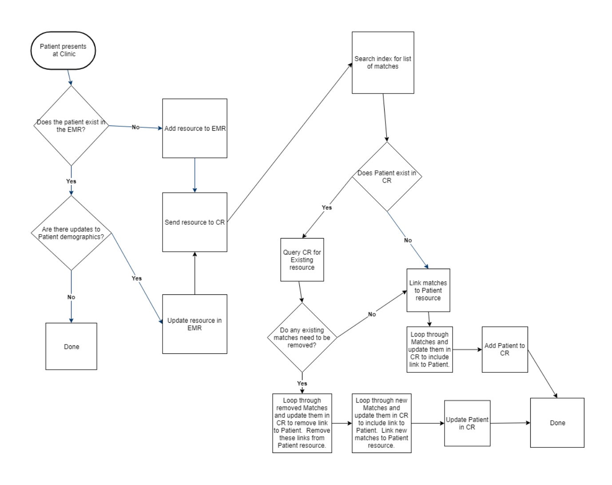

# Workflow

## Big picture

The process for a point-of-service system like an EMR to get a unique ID from the Client Registry is straightforward though it looks complicated at first.

Let's break this down.

1. A POS provides some demographic information to the Client Registry.
2. The Client Registry looks for an existing record matching that patient
3. If there is an existing record, the Client Registry provides the unique ID back to the POS.
4. If there is not a record, the Client Registry makes a new one and provides that back to the POS.

## Requirements

In order for this process to work as expected, there are some requirements:

* Requests sent to the Client Registry must be made of FHIR messages. FHIR is a popular specification for accessing and an API for providing data in health systems. Messages must support FHIR R4.
* ...